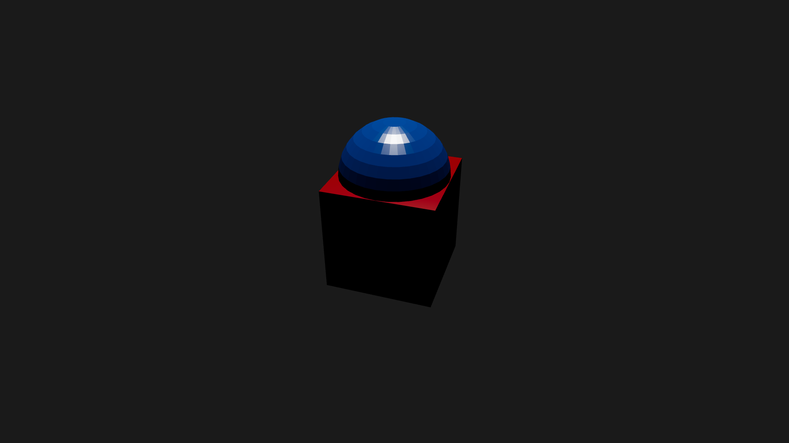

# React | Threejs

### Basic Course

Curso de integración y uso de la herramienta de Threejs con React para la web.

## Tools

- [Nodejs](https://nodejs.org/es/)
- [Yarn](https://yarnpkg.com/)
- [React](https://es.reactjs.org/)
- [Libreria three (Threejs Core)](https://threejs.org/)
- [Librerías de @react-three](https://docs.pmnd.rs/react-three-fiber/getting-started/introduction)
